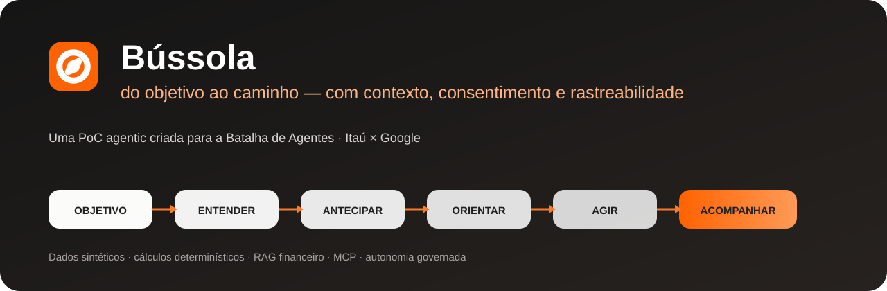
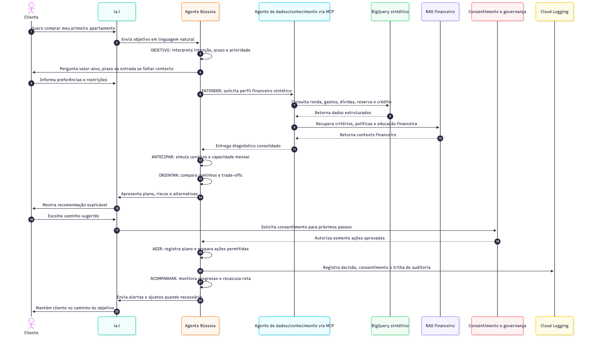
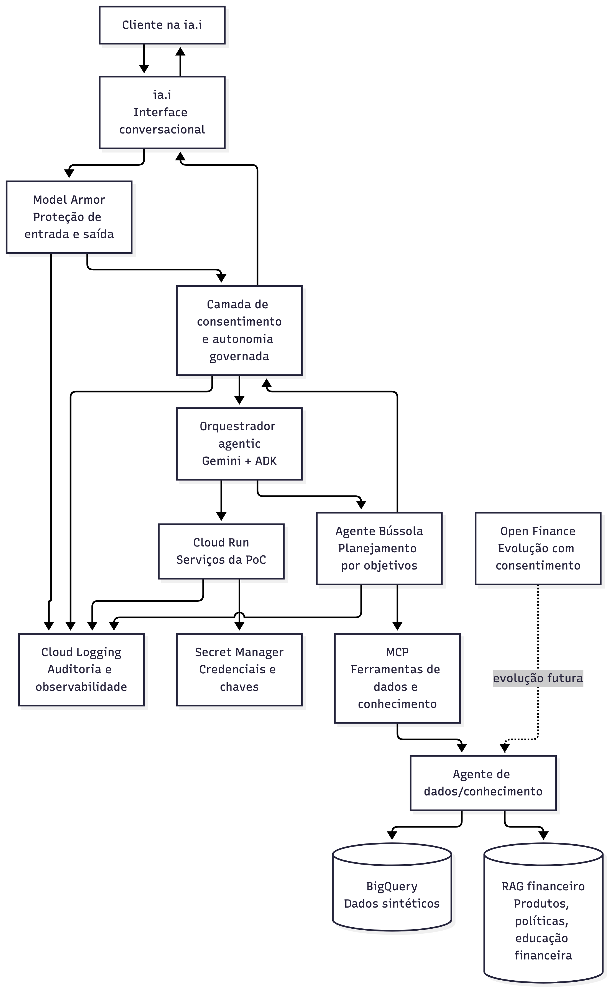

# Bússola

**Uma jornada agentic que transforma sonhos e objetivos financeiros em caminhos executáveis.**


Bússola nasceu na **Batalha de Agentes — Itaú × Google**. O agente parte de um objetivo declarado pelo cliente, entende sua situação financeira, antecipa cenários, orienta a tomada de decisão, aciona próximos passos com consentimento e acompanha a evolução até a realização do objetivo.

## Colaboração

O projeto foi desenvolvido em equipe. **Victor Lopes ([theguitarvity](https://github.com/theguitarvity)) originou e liderou o repositório e a implementação técnica.** Kell Bonassoli ([eusouakell](https://github.com/eusouakell)) participou especialmente da estratégia, contexto, pesquisa, Responsible AI, narrativa e materiais compartilhados. O enquadramento do produto e os artefatos da hackathon foram construídos colaborativamente.

## A ideia em uma linha

> O cliente não começa escolhendo um produto bancário. Ele começa com um objetivo.

A Bússola traduz essa intenção em uma jornada:

```text
OBJETIVO → ENTENDER → ANTECIPAR → ORIENTAR → AGIR → ACOMPANHAR
```

<p align="center">
  
</p>

## O que a PoC demonstra

A persona de referência é **Fernando**, 30 anos, usando dados sintéticos para planejar a compra do primeiro apartamento.

A Bússola demonstra:

- interpretação de objetivo em linguagem natural;
- dados financeiros estruturados e sintéticos;
- RAG de produtos, políticas e educação financeira;
- ferramentas via MCP;
- cenários e cálculos determinísticos;
- autonomia governada;
- consentimento antes de ações sensíveis;
- rastreabilidade de ferramentas e decisões;
- acompanhamento recorrente do plano.

## Arquitetura

<p align="center">
  
</p>

| Camada | Papel |
|---|---|
| **Experiência** | React/Vite + conversa + vistas de plano |
| **Orquestração** | Gemini + Agent Development Kit |
| **Ferramentas** | MCP para dados e conhecimento |
| **Dados** | fixtures sintéticas / BigQuery no modo de referência |
| **Conhecimento** | RAG financeiro |
| **Governança** | consentimento, regras determinísticas e auditoria |
| **Execução** | local ou Cloud Run |
| **Observabilidade** | eventos, ferramentas, erros e decisões |

[Ver arquitetura detalhada →](docs/arquitetura.md)

## Rodar agora — sem GCP

O modo simulado é suficiente para explorar a experiência inteira sem backend e sem conta Google Cloud.

### Front

```bash
cd web
npm ci
npm run dev
```

Abra `http://localhost:5173`.

O modo padrão é **Simulado**: usa fixtures sintéticas, não chama rede, Gemini, BigQuery ou GCP.

### Stack local com agente

Para executar ADK + MCP localmente:

```bash
cp contracts/env.example .env
make mcp
make agent
make web
```

O LLM ainda exige uma configuração válida de Gemini/Vertex conforme `contracts/env.example`.

## Demo pública

A conta GCP da hackathon foi encerrada, então as URLs antigas não representam uma implantação ativa.

A reativação está desenhada em duas camadas:

1. **Demo pública estática** — modo simulado, sem backend ou custo de inferência.
2. **Live Lab controlado** — ADK + MCP + Gemini, com dados sintéticos e acesso limitado.

[Ver plano de reativação →](docs/reactivation-plan.md)

> O `docs/operacao.md` registra a infraestrutura usada durante a hackathon e deve ser tratado como referência histórica até a migração para um novo projeto.

## Context Engineering

Bússola também é um caso aplicado de separação de contexto em um sistema agentic:

```text
OBJETIVO DO USUÁRIO
        ↓
CONTEXTO FINANCEIRO
        ↓
DADOS CONHECIDOS vs INFERIDOS
        ↓
CÁLCULOS DETERMINÍSTICOS
        ↓
PRODUTOS / POLÍTICAS / RAG
        ↓
CONSENTIMENTO + ESCOPO
        ↓
AGENTE + FERRAMENTAS
        ↓
RASTREABILIDADE + ACOMPANHAMENTO
```

Regras importantes:

- não inferir atributos ausentes dos dados;
- não delegar cálculos financeiros críticos ao raciocínio livre do modelo;
- separar orientação de execução;
- exigir consentimento antes de ação sensível;
- preservar fontes, confiança e rastreabilidade.

[Ver case de Context Engineering →](docs/context-engineering-case-study.md)

## UX: próxima evolução

Os testes da PoC revelaram oportunidades úteis para transformar o protótipo em uma experiência mais robusta:

- recuperação melhor fora do happy path;
- contrato visual para cards vs. texto livre;
- estados de latência e falha que preservem confiança;
- hierarquia mais clara de avisos;
- consentimento mais explícito;
- simplificação das vistas de “Meu plano”;
- separação entre **Demo pública** e **Bastidores / modo laboratório**;
- rodada dedicada de acessibilidade.

[Ver UX review priorizada →](docs/ux-review.md)

## Bastidores

O front já expõe uma visão técnica que torna o comportamento do agente inspecionável:

- **Jornada** — estado atual;
- **Ferramentas** — chamadas, argumentos mascarados, fonte e status;
- **Consentimentos** — ações pendentes, aceitas ou recusadas;
- **Auditoria** — eventos da sessão;
- **Modo demonstração** — simulado, ao vivo e cenários de borda.

Isso permite demonstrar não apenas *o que* a Bússola responde, mas **como o sistema chegou ali**.

## Documentação

### Produto
- [Ficha de submissão](docs/ficha-submissao.md)
- [Jornada agentic](docs/jornada-agentic.md)
- [Escopo e decisões](docs/escopo-decisoes.md)
- [Roteiro da demo](docs/roteiro-demo.md)

### Arquitetura
- [Arquitetura](docs/arquitetura.md)
- [Dados e tecnologia](docs/dados-tecnologia.md)
- [Blueprint](docs/blueprint-arquitetura.md)
- [Contexto de implementação — Spec Master](docs/contexto-spec-master.md)
- [Contratos entre ciclos](docs/ciclos/contratos.md)

### Evolução
- [Context Engineering case study](docs/context-engineering-case-study.md)
- [UX review](docs/ux-review.md)
- [Reactivation plan](docs/reactivation-plan.md)
- [Runbook da infraestrutura da hackathon](docs/operacao.md)

---

**PoC com dados sintéticos.** Bússola não oferece aconselhamento financeiro, não executa movimentações reais e não garante aprovação de crédito.
