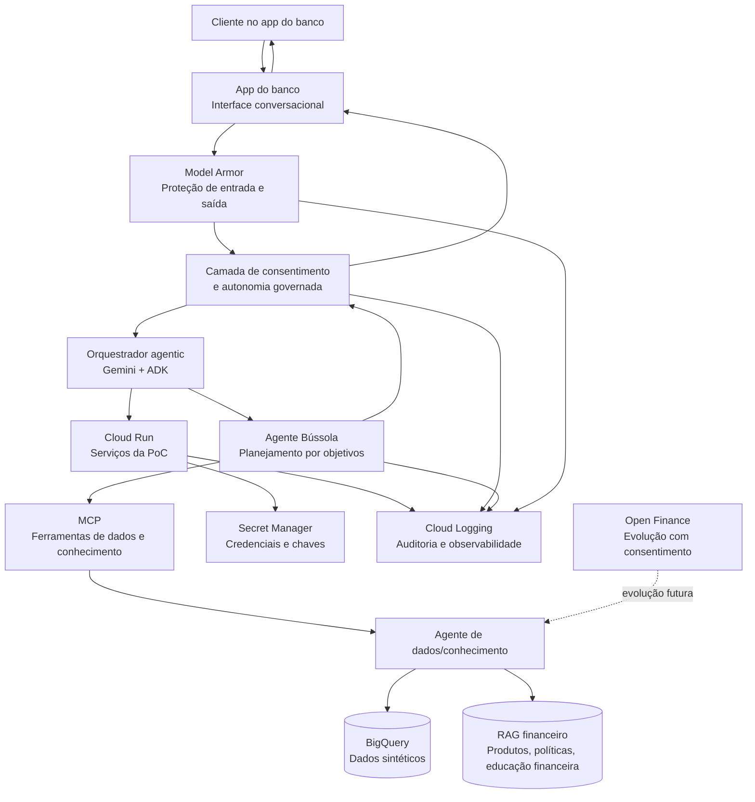

# Arquitetura da Bússola

Este documento descreve a arquitetura de referência da PoC da Bússola para a Batalha de Agentes.

## Visão geral

A arquitetura combina uma interface conversacional no app do banco, orquestração agentic com Gemini/ADK, um agente de dados e conhecimento via MCP, dados sintéticos no BigQuery, RAG financeiro e controles de segurança, consentimento e observabilidade na GCP.

## Diagrama Mermaid — Arquitetura

## Componentes

### App do banco

Canal de entrada da jornada. Recebe o objetivo do cliente em linguagem natural e devolve perguntas, diagnósticos, planos e próximos passos.

### Gemini + ADK

Base de raciocínio, planejamento e coordenação da experiência agentic. O ADK organiza os passos do agente, chamadas de ferramenta e estados da jornada.

### Agente Bússola

Responsável por transformar o objetivo do cliente em plano executável. Ele interpreta intenção, pede informações faltantes, calcula viabilidade, compara cenários e propõe próximos passos.

### MCP

Camada de ferramentas conectáveis. Na PoC, expõe capacidades de consulta a dados sintéticos e recuperação de conhecimento financeiro.

### BigQuery

Base sintética da PoC, com informações estruturadas de renda, gastos, dívidas, reservas, perfil de crédito, metas e histórico financeiro simulado.

### RAG financeiro

Base de conhecimento para apoiar respostas explicáveis, com conteúdos de educação financeira, critérios de produtos, políticas, regras de elegibilidade e orientações contextualizadas.

### Model Armor

Protege entradas e saídas do agente, reduzindo riscos de prompt injection, vazamento de dados, conteúdo inadequado e respostas fora da política definida.

### Secret Manager

Armazena credenciais e segredos usados pelos serviços, sem exposição no código ou nas mensagens do agente.

### Cloud Run

Hospeda serviços da PoC, como APIs de orquestração, conectores MCP e endpoints auxiliares.

### Cloud Logging

Registra eventos relevantes da jornada, chamadas de ferramenta, decisões de consentimento, erros e métricas de execução.

### Open Finance

Evolução do escopo. No MVP, os dados são sintéticos no BigQuery. Em uma versão futura, mediante consentimento do cliente, dados externos poderão enriquecer o diagnóstico e as recomendações.

## Princípios de segurança e governança

- Ações sensíveis exigem consentimento explícito.
- O agente deve explicar recomendações em linguagem clara.
- O agente deve diferenciar diagnóstico, simulação e ação.
- Dados sintéticos são usados na PoC.
- Open Finance entra como evolução com consentimento.
- Logs devem permitir auditoria sem expor dados desnecessários.
- Respostas passam por proteção de entrada e saída.

