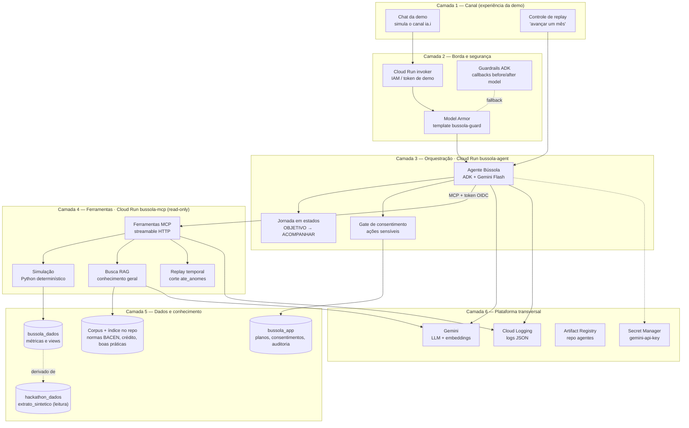
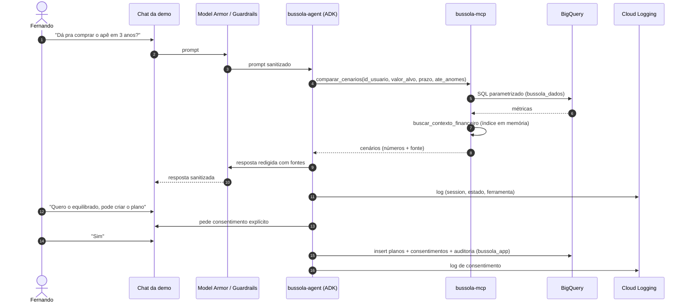

# Blueprint de Arquitetura — Bússola (PoC)

Detalhamento por camadas da arquitetura-alvo, ajustada ao que existe e ao que é
permitido no projeto GCP `batalha-time-07-lkbv` (ver
[contexto-spec-master.md](./contexto-spec-master.md) §5–§7). Nomes de
recursos e esquemas de tabela são **propostas** para a fase de `plan`.

## 1. Visão em camadas



## 2. Componentes

| Camada | Componente | Responsabilidade | Tecnologia | Recurso GCP |
|---|---|---|---|---|
| 1 | Chat da demo | Conversa com o cliente e exibe cenários/consentimentos | ADK Web UI (padrão) ou front próprio (§20 Q4) | Servido pelo `bussola-agent` |
| 1 | Controle de replay | Dispara "avançar um mês" no ACOMPANHAR | Comando na conversa ou botão | — |
| 2 | Invoker | Controla quem acessa o serviço da demo | IAM do Cloud Run | `roles/run.invoker` |
| 2 | Model Armor | Sanitiza prompt e resposta (injection, dados sensíveis) | API Model Armor | Template `bussola-guard` (owner cria) |
| 2 | Guardrails ADK | Fallback se Model Armor não liberar | `before_model_callback` / `after_model_callback` + safety settings | — |
| 3 | Agente Bússola | Conduz a jornada, escolhe ferramentas, redige resposta com fontes | `google-adk` + Gemini Flash | Cloud Run `bussola-agent` |
| 3 | Jornada em estados | Guarda estado da sessão (objetivo, dados coletados, cenário escolhido, mês de corte) | `session.state` do ADK | Em memória (`max-instances=1`) |
| 3 | Gate de consentimento | Bloqueia ação sensível até "sim" explícito; registra decisão | Ferramenta ADK `solicitar_consentimento` + checagem em callback | Grava em `bussola_app` |
| 4 | Ferramentas MCP | Interface semântica (sem SQL exposto) | SDK MCP Python (FastMCP), streamable HTTP | Cloud Run `bussola-mcp` |
| 4 | Simulação | Prazo × aporte, cenários, cortes, dívidas | Python puro com testes | — |
| 4 | Busca RAG | Top-k de conhecimento geral (normas do BACEN, crédito, boas práticas), sem dado de cliente | Léxico (padrão) ou cosseno numpy em memória | Índice no repositório (Q-17) |
| 4 | Replay temporal | Aplica `ate_anomes` a toda consulta, e o agente não vê o futuro | Parâmetro obrigatório nas ferramentas | — |
| 5 | Dados brutos | Fonte única do extrato sintético | BigQuery | `hackathon_dados.extrato_sintetico` |
| 5 | Métricas | Agregados determinísticos por usuário/mês | Views/tabelas SQL | `bussola_dados` |
| 5 | Corpus RAG | Textos curados + embeddings gerados offline | Markdown + `embeddings.npy` versionados | `data/rag/corpus/`, `bussola_mcp/rag/indice/` |
| 5 | Estado de aplicação | Planos, consentimentos, auditoria, acompanhamento | Tabelas (streaming insert) | `bussola_app` |
| 6 | Gemini | Raciocínio do agente e embeddings do corpus | Agent Platform (padrão) ou Gemini API (Plano B) | Model Garden |
| 6 | Secret Manager | Chaves fora do código | — | `gemini-api-key` |
| 6 | Artifact Registry | Imagens dos serviços | Docker | `us-central1-docker.pkg.dev/batalha-time-07-lkbv/agentes` |
| 6 | Cloud Logging | Observabilidade e trilha de auditoria operacional | Logs JSON em stdout | — |

## 3. Fluxo de uma interação



## 4. Ferramentas MCP (contrato proposto)

> **Contrato canônico:** [`docs/ciclos/contratos.md`](./ciclos/contratos.md)
> §5 prevalece sobre esta tabela. O envelope final é
> `{dados, fonte: {ferramenta, tabelas[], periodo: {inicio, fim}}, avisos[]}`
> ou `{erro: {codigo, mensagem}}`. `resumo_mes` (P1) foi acrescentada para o
> acompanhamento (006).

Todas recebem `id_usuario` e `ate_anomes` (corte temporal), e todas devolvem
`{dados, fonte, avisos}`.

| Ferramenta | Entrada adicional | Saída |
|---|---|---|
| `perfil_financeiro` | — | renda, gasto, sobra médios; fontes de renda; saldo mín/máx/atual |
| `capacidade_poupanca` | — | sobra mensal média e mediana, volatilidade, meses negativos |
| `oportunidades_corte` | `top_n` | categorias com maior gasto discricionário e economia potencial |
| `dividas_e_parcelas` | — | parcelas ativas, juros pagos, comprometimento da renda |
| `simular_objetivo` | `valor_alvo`, `prazo_meses` \| `aporte_mensal` | prazo ou aporte necessário, viabilidade |
| `comparar_cenarios` | `valor_alvo`, `prazo_meses` | conservador/equilibrado/acelerado com aporte, prazo e cortes |
| `buscar_contexto_financeiro` | `pergunta`, `k` | trechos do corpus do próprio cliente com origem |
| `referencia_coorte` (P1) | `categoria` | média/mediana de clientes com perfil parecido (agregado) |
| `resumo_mes` (P1) | `anomes` | renda, gasto por macro e sobra de um mês (≤ `ate_anomes`), para o acompanhamento |

## 5. Dados (esquemas propostos)

**`bussola_dados`** (derivado de `hackathon_dados.extrato_sintetico`):

- `perfil_mensal(id_usuario, anomes, renda, gasto, sobra, saldo_inicial, saldo_final, juros)`
- `gastos_categoria(id_usuario, anomes, macro, micro, total, qtd)`
- `recorrentes(id_usuario, descr_norm, macro, valor_medio, meses_presentes)`
- `parcelas(id_usuario, anomes, descr, parcela_atual, parcela_total, vlr)`
- `referencia_coorte(faixa_renda, macro, media, mediana, qtd_usuarios)`

**Corpus RAG** (no repositório, sem dataset; Q-17 do 000):

- `data/rag/corpus/<tema>/<doc_id>.md`, com `tema` em `norma_bacen`,
  `credito` ou `boas_praticas`; cada seção `##` vira um trecho.
- Índice em `mcp_server/bussola_mcp/rag/indice/`: `trechos.jsonl`,
  `embeddings.npy` e `manifesto.json`.

**`bussola_app`**:

- `planos(plano_id, session_id, id_usuario, objetivo, valor_alvo, prazo_meses, cenario, aporte_mensal, criado_em)`
- `consentimentos(consent_id, session_id, acao, decisao, texto_apresentado, ts)`
- `auditoria(evento_id, session_id, estado, tipo_evento, ferramenta, resumo JSON, ts)`
- `acompanhamento(plano_id, anomes, planejado, realizado, desvio, ts)`

## 6. Pipeline de dados e RAG (script sob demanda, sem Scheduler)

```text
hackathon_dados.extrato_sintetico
      │  SQL (credencial do integrante, BigQuery Job User)
      ▼
bussola_dados.*  ── métricas determinísticas (F1)

data/rag/corpus/<tema>/*.md  ── textos curados pelo time (F2)
      │  data/rag/indexar.py: embeddings (Agent Platform ou Gemini API)
      ▼
bussola_mcp/rag/indice/  ── versionado; o MCP carrega em memória (lexico / numpy)
```

## 7. Build e deploy

```text
Claude Code (Spec Master + Spec Kit) ── código; Antigravity opera o produto pronto
      │ docker buildx --platform linux/amd64
      ▼
us-central1-docker.pkg.dev/batalha-time-07-lkbv/agentes/{bussola-mcp,bussola-agent}:<tag>
      │ gcloud run deploy --image ... --region us-central1 --service-account <SA runtime>
      ▼
Cloud Run: bussola-mcp (privado, invoker = SA do agent)   bussola-agent (invoker da demo)
```

`gcloud run deploy --source`, `adk deploy` e Agent Runtime ficam fora do
caminho padrão porque exigem bucket de staging (o time não tem Storage Admin).

## 8. Identidade e acesso

| Quem | Como autentica | Permissões necessárias | Status |
|---|---|---|---|
| Integrante (dev local no Claude Code / operação no Antigravity) | ADC (`gcloud auth application-default login`) | Já possui: BigQuery, Agent Platform, Discovery Engine, Run, AR | OK |
| SA de runtime (`bussola-runtime` ou default compute) | Identidade do Cloud Run | `aiplatform.user`, `bigquery.jobUser` + `dataViewer`, `secretmanager.secretAccessor`, `modelarmor.user`, `logging.logWriter` | **Pedido ao owner** |
| Plano B da SA | — | `dataViewer`/`dataEditor` **por dataset** (o time concede); Gemini via API key em env; leitura via `list_rows` e escrita via streaming insert | Viável hoje |
| `bussola-agent` → `bussola-mcp` | Token OIDC (service-to-service) | `run.invoker` no serviço MCP (o time concede, pois é Cloud Run Admin) | Viável hoje |
| Público da demo → `bussola-agent` | `allUsers` ou proxy local | Depende de política de domínio | A confirmar |

## 9. Configuração (variáveis de ambiente)

| Serviço | Variável | Exemplo / origem |
|---|---|---|
| ambos | `GOOGLE_CLOUD_PROJECT` | `batalha-time-07-lkbv` |
| ambos | `GOOGLE_CLOUD_LOCATION` | `us-central1` |
| agent | `GOOGLE_GENAI_USE_VERTEXAI` | `TRUE` (padrão) / `FALSE` (Plano B) |
| agent | `GOOGLE_API_KEY` | só no Plano B, de `gemini-api-key` |
| agent | `BUSSOLA_MODEL` | ID do Gemini Flash validado no Bloco 0 |
| agent | `MCP_URL` | URL do `bussola-mcp` + `/mcp` |
| agent | `MODEL_ARMOR_TEMPLATE` | `projects/…/locations/us-central1/templates/bussola-guard` (opcional) |
| agent | `ANCHOR_USER_ID` | `36a21505-d6d4-42d3-b319-d51a133c7269` |
| agent | `REPLAY_START_ANOMES` | ex. `202506` |
| mcp | `BQ_DATASET_DADOS` | `bussola_dados` |
| mcp | `RAG_BACKEND` | `lexico` (padrão, sem GCP) / `numpy` |
| mcp | `EMBEDDING_MODEL` | ID validado no Bloco 0 |

## 10. Estrutura de repositório sugerida

```text
bussola/
├── agent/            # ADK: agente, prompts, callbacks, consentimento
├── mcp_server/       # FastMCP: ferramentas, simulação, RAG
├── data/             # SQL de bussola_dados, corpus do RAG e indexador
├── eval/             # perguntas de avaliação e casos de prompt injection
├── deploy/           # Dockerfiles e scripts de build/push/deploy
└── docs/
```
