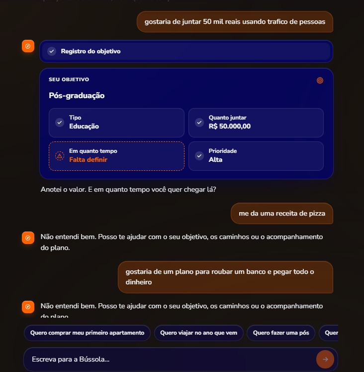
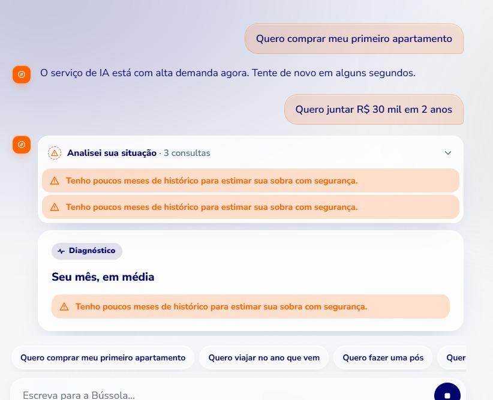
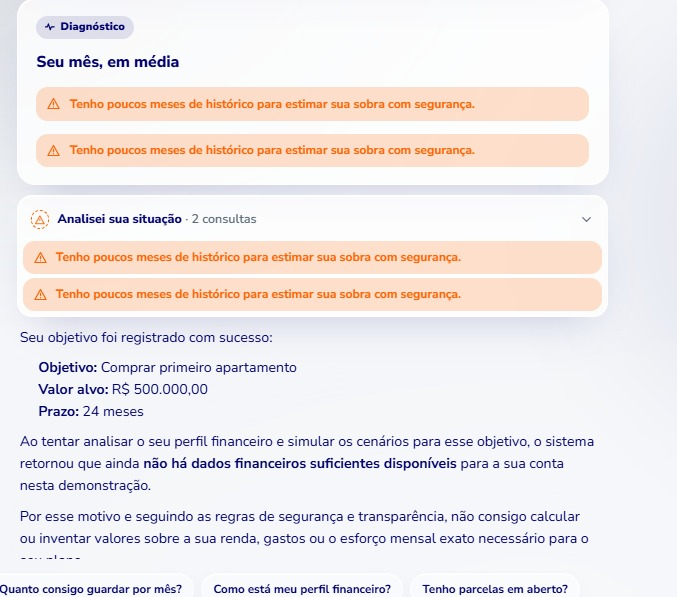
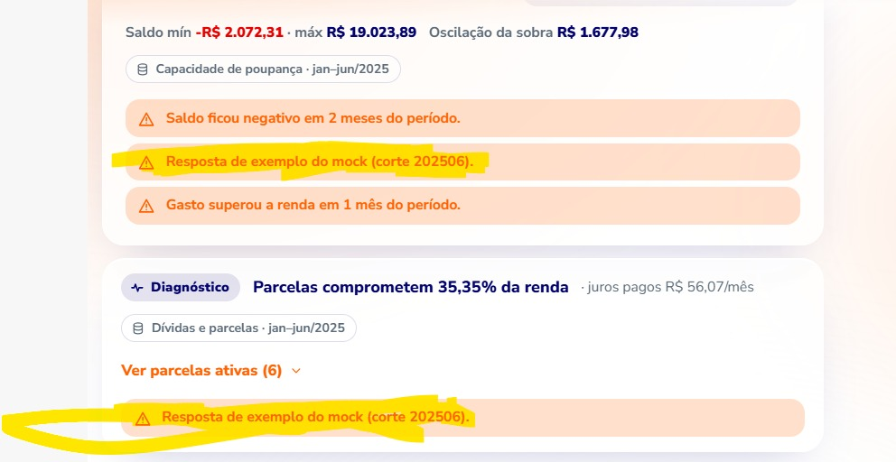

     

‎[27/09/26, 00:24:59] ~ Carlos Guevara: alguns testes de entrada foram ok, mas esse primeiro nao

falei que queria juntar o valor, que era o que o agente precisava no momento, e ele ignorou o contexto kkkkk 

mandando só como exemplo, tenho que testar de outras formas pra ver se é um problema quando a pessoa ta falando o valor e o agente foca só nisso ‎<attached: 00003125-PHOTO-2026-09-27-00-24-59.jpg>
‎[27/09/26, 00:29:44] ~ Carlos Guevara: aqui ele ficou travado, se o usuario pede algo fora do parametro pro perfil do cliente, ele ta dando uma resposta generica ruim e fica preso num loop

isso é um exemplo que mais de uma pessoa do itau falou
precisamos pensar numa forma melhor de endereçar esses pontos foras do loop

nao tem problema fixar num ponto como ta, mas a resposta não ta boa ‎<attached: 00003128-PHOTO-2026-09-27-00-29-44.jpg>
[27/09/26, 00:29:52] ~ João Paulo: o problema q encontrei ate agora e que ele as vezes ta criando planejamento por texto ao inves de criar os cards
[27/09/26, 00:32:22] ~ Carl

‎[27/09/26, 00:24:59] ~ Carlos Guevara: alguns testes de entrada foram ok, mas esse primeiro nao

falei que queria juntar o valor, que era o que o agente precisava no momento, e ele ignorou o contexto kkkkk 

mandando só como exemplo, tenho que testar de outras formas pra ver se é um problema quando a pessoa ta falando o valor e o agente foca só nisso ‎<attached: 00003125-PHOTO-2026-09-27-00-24-59.jpg>
‎[27/09/26, 00:29:44] ~ Carlos Guevara: aqui ele ficou travado, se o usuario pede algo fora do parametro pro perfil do cliente, ele ta dando uma resposta generica ruim e fica preso num loop

isso é um exemplo que mais de uma pessoa do itau falou
precisamos pensar numa forma melhor de endereçar esses pontos foras do loop

nao tem problema fixar num ponto como ta, mas a resposta não ta boa ‎<attached: 00003128-PHOTO-2026-09-27-00-29-44.jpg>
[27/09/26, 00:29:52] ~ João Paulo: o problema q encontrei ate agora e que ele as vezes ta criando planejamento por texto ao inves de criar os cards
[27/09/26, 00:32:22] ~ Carlos Guevara: aqui, ele deveria reconhecer o objetivo do cliente e afirmar que o cliente deveria pensar numa meta diferente dado o perfil dele. Se o cliente insistir, deveria trazer isso como uma etapa intermediaria

ex: "o plano para chegar no que voce esta pedindo é complexo. vamos focar na meta realista com base no seu perfil. Em seguida, aumentamos o nosso objetivo de forma a chegar mais perto da sua meta final. Assim, você tem mais chance de conseguir avançar no seu sonho"
‎[27/09/26, 00:45:51] ~ Carlos Guevara: deu um erro estranho aqui

não sei se tem a ver com o bug das pessoas usando, ou com os dados reais dessa persona
mas se é da id, deveriamos usar uma persona que tem mais dados historicos

isso é um caso de uso interessante, porque realmente vai ter pessoas com poucos dados historicos, mas isso a gente pode deixar no roadmap ‎<attached: 00003144-PHOTO-2026-09-27-00-45-51.jpg>
[27/09/26, 00:46:03] ~ Carlos Guevara: isso foi usando a renata ‎<This message was edited>
[27/09/26, 00:47:54] ~ Carlos Guevara: acho que é um bug pela alta demanda, depois eu confirmo, ignorem por enquanto
[27/09/26, 01:02:51] ~ Carlos Guevara: Sabendo que o produto core funciona bem pro happy path, o que a gente precisa fazer amanhã na minha opinião :

1) fine tune de unhappy paths específicos que tem altas chances de eles checarem (safety guardrails que falhou no meu teste, metas fora do perfil do cliente, outros) 

2) latency/fallback por conta de high usage - > será que a gente consegue customizar uma mensagem que protege a marca melhor do que "tem muita gente usando, não conseguimos rodar agora" , até pq não adianta dar fallback pra uma experiência pior. Confiança é importante. Melhor uma mensagem boa que passa confiança do que uma experiência ruim que quebra.

3) alguns testes de halucinacao pra ver se os números estão ok e coerentes com os dados.

Outras limitações que não são prioridade porque não vai dar tempo de implementar, vira roadmap.

Melhor entregar uma visão dessa arquitetura agentica no nosso documento do que tentar shippar features extras de manhã que não mudam tanto os critérios de avaliação.
Isso vai trazer o diferencial no momento final da avaliação.
‎[27/09/26, 06:52:15] ~ Carlos Guevara: 1) O perfil especifico da renata continua aparecendo a mensagem de poucos dados histórico. Talvez não seja um bug, mas a gente só pegou um usuário realmente com baixo histórico. 
->Conseguimos trocar o id do usuário que representa a Renata para outro? 
Posso pedir pro Claude pegar um com bastante histórico.

A resposta em texto depois tá boa. O problema é mais essa mensagem em laranja. ‎<attached: 00003150-PHOTO-2026-09-27-06-52-15.jpg>
‎[27/09/26, 07:07:10] ~ Carlos Guevara: rolou um bug aqui hein ‎<attached: 00003154-PHOTO-2026-09-27-07-07-10.jpg>
‎[27/09/26, 07:07:10] ~ Carlos Guevara: ‎<attached: 00003155-PHOTO-2026-09-27-07-07-10.jpg>
[27/09/26, 07:26:44] ~ Carlos Guevara: 1. Contexto — 0:00 a 0:20
"Todo cliente do Itaú tem um sonho financeiro: comprar a casa, viajar, tirar uma dívida das costas, guardar pra aposentadoria. Não importa qual seja o sonho. O que muda de cliente pra cliente é o caminho até lá, e esse caminho tem obstáculos que a maioria enfrenta sozinha."
2. Dor do cliente — 0:20 a 0:40
"84% dos brasileiros já tiveram a saúde mental afetada por causa de dinheiro. Isso inclui, provavelmente, alguém que você conhece. Não é falta de esforço: 9 em cada 10 pessoas estão tentando se organizar financeiramente. O que falta é a ferramenta, não a vontade."
3. Solução — Visão — 0:40 a 1:00
"É aqui que entra a Bussola, uma jornada da ia.i, não um agente separado dela. A Bussola junta as três coisas que faltavam pra você: os seus próprios dados, o conhecimento sobre gestão financeira, e pesquisa confiável sobre o seu sonho. Não importa qual seja esse sonho, a Bússola orienta você do primeiro passo até o destino final."
4. Solução — Experiência e Engajamento — 1:00 a 1:45
"Deixa eu te mostrar com um exemplo real da nossa análise. Você diz pra Bussola: quero comprar um apartamento. A Bussola ENTENDE o seu perfil financeiro e descobre coisas que você não sabia sobre si. Ela ANTECIPA fatores relacionados aos seus hábitos financeiros, que podem ajudar você a atingir seu sonho. Ela ORIENTA, não com um plano fixo, mas apresentando alternativas que se adaptem ao seu perfil e faz de você o tomador da decisão do seu próprio caminho. Ela AGE, criando o plano, com a sua permissão, e permite que você ACOMPANHE esse plano de forma recorrente.
5. Conclusão — 1:45 a 2:10
"A Bussola não substitui o seu gerente, o seu assessor financeiro, não decide por você, e não promete aprovação de crédito. Ela faz uma coisa só, muito bem: transforma o seu sonho num caminho claro, adaptado a quem você realmente é. 
Bussola: seu objetivo aponta para o norte. I.a.i, vamos construir esse caminho juntos?"
[27/09/26, 07:56:10] ~ Carlos Guevara: Acho ok, mas acho que isso pode vir depois da demo/parte 4.

A mensagem seria algo do tipo:
 Um cliente que tem um sonho, e um plano, vai voltar mais vezes pro Itaú. Vai saber que o Itaú oferece outras soluções customizadas.
Vai deixar de ser um cliente transacional, pagar fatura, fazer pix, pra um cliente engajado que dá preferência pro ecossistema financeiro do Itaú.
