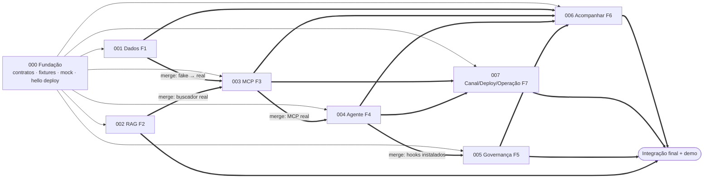

# Bússola — Plano de ciclos paralelos (Spec Master)

> Divide o roadmap de `docs/contexto-spec-master.md` §15 em **ciclos
> independentes**, executáveis em paralelo. Cada ciclo tem seu próprio
> arquivo de contexto para `/spec-master`.
>
> **Onde cada coisa roda:**
>
> - **Desenvolvimento:** Claude Code + Spec Master. Cada ciclo roda numa
>   sessão própria, dentro de uma git worktree própria.
> - **Operação do produto pronto:** Google Antigravity (Santo Digital), com o
>   runbook entregue pelo ciclo 007 (`AGENTS.md` + `docs/operacao.md`).

## 1. Ciclos

| Ciclo | Feature | Prio | Onda | Depende de (duro) | Começa com | Arquivo de contexto |
|---|---|---|---|---|---|---|
| **000** | Fundação e contratos | — | 0 | — | — | [000-fundacao-contratos.md](./000-fundacao-contratos.md) |
| **001** | F1 Camada de dados financeiros | P0 | 1 | 000 | fixtures do 000 | [001-camada-dados-financeiros.md](./001-camada-dados-financeiros.md) |
| **003** | F3 MCP de dados e conhecimento | P0 | 1 | 000 | fakes (`BUSSOLA_FAKES`) | [003-mcp-dados-conhecimento.md](./003-mcp-dados-conhecimento.md) |
| **004** | F4 Agente Bússola e jornada | P0 | 1 | 000 | MCP mock do 000 | [004-agente-bussola-jornada.md](./004-agente-bussola-jornada.md) |
| **007** | F7 Canal, deploy e operação | P0 | 1 | 000 | serviços hello do 000 | [007-canal-deploy-demo.md](./007-canal-deploy-demo.md) |
| **002** | F2 RAG de conhecimento (BACEN, crédito, boas práticas) | P0/P1 | 2 | 000 | corpus curado do 000 | [002-rag-financeiro-dados.md](./002-rag-financeiro-dados.md) |
| **005** | F5 Consentimento, governança e auditoria | P0/P1 | 2 | 000 | hooks e `RegistroEmMemoria` do 000 | [005-consentimento-governanca.md](./005-consentimento-governanca.md) |
| **006** | F6 Acompanhamento com replay | P1 | 3 | 000 (dev) · 001+003+004+005 (merge) | fakes + `RegistroEmMemoria` | [006-acompanhamento-replay.md](./006-acompanhamento-replay.md) |

Os números de spec (`specs/NNN-*`) são **fixos**. Seguem o contexto mestre,
por isso o ciclo do MCP é o 003 e o do RAG é o 002, mesmo que o 003 comece
antes.

Contratos que tornam o paralelismo possível: [contratos.md](./contratos.md).

## 2. Dependências



- **Linha fina (`-->`):** pode começar. Os contratos do 000 bastam.
- **Pontilhada:** marco de dados publicado no BigQuery. Não é merge de
  código.
- **Grossa (`==>`):** a integração real só fecha depois do merge da
  dependência. Até lá, o ciclo trabalha com fakes.

## 3. Ondas

| Onda | Ciclos | Como |
|---|---|---|
| **0** | 000 | Sequencial. Congela os contratos (`contratos-v1`) e bloqueia todo o resto. Deve ser **curta**: é esqueleto, não produto. |
| **1** | 001 ∥ 003 ∥ 004 ∥ 007 | Caminho crítico da fatia vertical. São 4 sessões Claude Code em paralelo. |
| **2** | 002 ∥ 005 | Podem começar **junto com a Onda 1** se houver capacidade (uma pessoa pode tocar 2 sessões). O 002 não depende do 001: o corpus é conhecimento geral no repositório (Q-17 do 000). |
| **3** | 006 → integração final | O 006 pode ser desenvolvido com fakes desde o início, mas só fecha depois do merge de 001, 003, 004 e 005. A integração final não é ciclo do Spec Master (§8). |

**Linha de corte**, igual ao contexto mestre §15, se faltar tempo:

1. backend `numpy` do 002 (fica o léxico);
2. `referencia_coorte`;
3. Model Armor (fica o fallback);
4. replay de mais de um mês.

**Nunca cortar:** 000, 001, 003, 004, o gate e a auditoria do 005, e o
deploy do 007.

## 4. Alocação sugerida (4 pessoas)

> Com 2 pessoas, veja [roadmap-2-pessoas.md](./roadmap-2-pessoas.md).

Os nomes ficam a critério do time; a sequência abaixo minimiza conflito,
porque quem mexe no mesmo diretório é a mesma pessoa.

| Pessoa | Sequência | Área |
|---|---|---|
| A | 000 (lidera, com todos) → **001** → 002 | Dados, simulação, RAG |
| B | **003** → 006 | MCP e replay |
| C | **004** → 005 | Agente, governança |
| D | **007** + pedidos ao owner (§16 do mestre) → integração final | Plataforma, canal, operação no Antigravity |

## 5. Regras de paralelismo (valem para todos os ciclos)

1. **1 ciclo = 1 worktree = 1 branch = 1 sessão Claude Code = 1 execução do
   Spec Master = 1 feature.** Nunca rode dois `/spec-master` na mesma pasta.
2. **Número de spec fixo.** O Spec Kit 0.8 numera `specs/` pelo próximo
   número livre da pasta, e em worktrees paralelas todos pegariam `001`. Por
   isso cada ciclo define `SPECIFY_FEATURE_DIRECTORY=specs/NNN-<slug>` (no
   arquivo de contexto e na variável de ambiente da sessão).
3. **Step 2 do Spec Master:**
   - o Spec Kit já estará inicializado (vem do 000);
   - na estratégia Git, responder **Trunk-Based**. A worktree já está na
     branch do ciclo, então o Spec Master não deve criar outra;
   - não instalar a extensão git do Spec Kit. Se ela aparecer habilitada em
     `specify extension list`, rodar `specify extension disable git`.
4. **`.spec-master/` é local** (está no `.gitignore`). A rastreabilidade de
   cada ciclo é exportada para `specs/NNN-*/traceability.md` e versionada.
5. **Constituição congelada após o 000.** Se o Step 4 de um ciclo propuser
   mudança, ela **não é aplicada**: vira `specs/NNN-*/proposta-constituicao.md`
   e é discutida no time.
6. **Contratos só via PR `contracts:`** ([contratos.md](./contratos.md) §0).
7. **Propriedade de diretórios** ([contratos.md](./contratos.md) §1). Cada
   ciclo só escreve nos seus caminhos. Em `pyproject.toml` e `Makefile`
   valem acréscimos, e o conflito se resolve pela união.
8. **Não depender de código não mergeado.** Use `BUSSOLA_FAKES=TRUE` e as
   fixtures. Quando a dependência chegar em `main`, o ciclo troca o fake pelo
   real no mesmo PR ou num PR de integração imediato.
9. **GCP compartilhado:**
   - **Testes:** gravam só em `bussola_app_dev`.
   - **`bussola_dados`:** só o 001 escreve.
   - **RAG:** sem dataset. Corpus e índice ficam no repositório, nos caminhos do 002.
   - **Cloud Run:** cada ciclo publica revisões com
     `--tag cNNN --no-traffic`. Só o 007 move tráfego.
10. **Rebase em `main` antes do PR.** O PR precisa de `make test` e
    `make lint` verdes, além dos critérios de aceite do ciclo.

## 6. Como disparar

### Pré-requisitos em cada máquina

- **Engine do Spec Master:** rode `./init.sh` a partir do repositório
  `ai-spec-master-skill`. Isso instala `~/.spec-master-engine` e o comando
  global `/spec-master` no Claude Code.
- **Spec Kit CLI:** `specify` 0.8+, por exemplo
  `uv tool install specify-cli --from git+https://github.com/github/spec-kit.git`.
- **Ferramentas locais:** `uv`, Python 3.12, Docker com `buildx` e `gcloud`.
- **Autenticação no GCP:**
  `gcloud auth application-default login` e
  `gcloud config set project batalha-time-07-lkbv`.

### Onda 0: ciclo 000

```bash
git switch main && git pull
git worktree add ../bussola-000 -b 000-fundacao-contratos
cd ../bussola-000
specify init --here --integration claude --script sh   # confirmar merge no diretório não vazio
specify extension list                                 # se "git" estiver habilitada: specify extension disable git
SPECIFY_FEATURE_DIRECTORY=specs/000-fundacao-contratos claude
```

No Claude Code:

```text
/spec-master docs/ciclos/000-fundacao-contratos.md
```

Ao final: PR `000-fundacao-contratos` → `main`, merge e tag `contratos-v1`:

```bash
git tag contratos-v1 && git push origin contratos-v1
```

### Ondas 1–3: um bloco por ciclo, só depois do merge do 000

Cada ciclo segue o mesmo padrão, trocando o `NNN-slug`:

```bash
git switch main && git pull
git worktree add ../bussola-001 -b 001-camada-dados-financeiros
cd ../bussola-001
SPECIFY_FEATURE_DIRECTORY=specs/001-camada-dados-financeiros claude
```

```text
/spec-master docs/ciclos/001-camada-dados-financeiros.md
```

| Ciclo | Worktree | Branch / `SPECIFY_FEATURE_DIRECTORY` (sem o prefixo `specs/`) | Argumento do `/spec-master` |
|---|---|---|---|
| 001 | `../bussola-001` | `001-camada-dados-financeiros` | `docs/ciclos/001-camada-dados-financeiros.md` |
| 003 | `../bussola-003` | `003-mcp-dados-conhecimento` | `docs/ciclos/003-mcp-dados-conhecimento.md` |
| 004 | `../bussola-004` | `004-agente-bussola-jornada` | `docs/ciclos/004-agente-bussola-jornada.md` |
| 007 | `../bussola-007` | `007-canal-deploy-demo` | `docs/ciclos/007-canal-deploy-demo.md` |
| 002 | `../bussola-002` | `002-rag-financeiro-dados` | `docs/ciclos/002-rag-financeiro-dados.md` |
| 005 | `../bussola-005` | `005-consentimento-governanca` | `docs/ciclos/005-consentimento-governanca.md` |
| 006 | `../bussola-006` | `006-acompanhamento-replay` | `docs/ciclos/006-acompanhamento-replay.md` |

**No app desktop do Claude Code:** abra uma sessão nova apontando para a
pasta da worktree (`../bussola-NNN`) e envie o mesmo `/spec-master …`. Sem a
variável de ambiente, o número da spec vem da regra §1 do próprio arquivo de
contexto.

**Respostas esperadas nos gates do Spec Master:**

- **Spec Kit:** já inicializado nos ciclos 001–007; aceitar
  `specify init --here` só no 000.
- **Estratégia Git:** **Trunk-Based**.
- **Conflito de constituição** (ciclos 001–007): **não aplicar** e registrar
  a proposta.
- **Team Mode** (opcional):
  - no 001: `sql` ∥ `simulacao`;
  - no 004: `prompts` ∥ `jornada/escopo`.

### Limpeza após o merge

```bash
git worktree remove ../bussola-001
git branch -d 001-camada-dados-financeiros
```

## 7. Ordem de merge e gates

Um ciclo mergeia quando os **seus** critérios de aceite estão verdes. A
ordem abaixo minimiza retrabalho:

| # | Ciclo | Gate de merge |
|---|---|---|
| 1 | 000 | Contratos materializados; mock MCP e agente hello rodando local e em Cloud Run; tag `contratos-v1` |
| 2 | 001 | Números do âncora batem com a referência (contratos §8); testes de simulação; tabelas v1 publicadas |
| 3 | 003 | Testes de contrato sobre fakes **e** `make test-bq` contra as tabelas do 001 |
| 4 | 004 | Jornada OBJETIVO → ORIENTAR contra o MCP real (local); eval de números |
| 5 | 007 | Os dois serviços reais em Cloud Run com OIDC; canal acessível; runbook testado no Antigravity |
| 6 | 002 | Corpus nos três temas + eval top-3 ≥ 80%; buscador plugado na ferramenta do 003 |
| 7 | 005 | Gate + auditoria em `bussola_app_dev`; guardrail com testes de injection |
| 8 | 006 | Avanço de mês com desvio, recálculo e auditoria |

## 8. Integração final e demo (checklist, liderada pela Pessoa D com todos)

- [ ] `main` publicada nos dois serviços (`us-central1`), com tráfego 100%
      na revisão final.
- [ ] Roteiro de ≤ 5 min executado ponta a ponta com o âncora, cobrindo os 6
      estados, o consentimento e um avanço de mês.
- [ ] Números das respostas idênticos aos das ferramentas (eval do 004
      rodado contra a produção).
- [ ] Consentimentos e auditoria visíveis em `bussola_app` e no Cloud
      Logging.
- [ ] Evals do 002, 004 e 005 executados, com resultado registrado em
      `eval/RESULTADOS.md`.
- [ ] Vídeo de backup gravado.
- [ ] Operação ensaiada no Antigravity seguindo `docs/operacao.md`: deploy,
      logs, auditoria, reset da demo e rollback.
- [ ] Definition of Done do contexto mestre §19 conferida.

## 9. Operação no Antigravity (visão geral)

Com o produto pronto, a operação passa para o Antigravity:

- deploy e rollback;
- leitura de logs e da auditoria;
- reset da sessão da demo e avanço de mês;
- troca para o Plano B.

O ciclo 007 entrega `AGENTS.md`, lido pelo agente do Antigravity, e
`docs/operacao.md` com comandos prontos. O desenvolvimento **não** acontece
no Antigravity: mudanças de código voltam para um ciclo no Claude Code.
