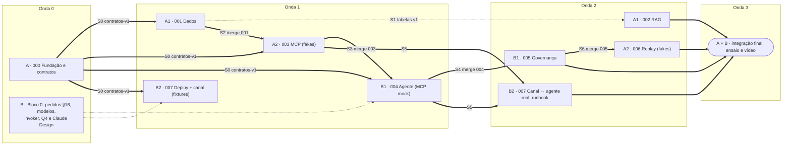

# Bússola — Roadmap para 2 pessoas

> Adapta o [plano de ciclos](./README.md) para **2 pessoas**, cada uma
> rodando **até 2 sessões Claude Code em paralelo** (uma worktree por
> sessão). As regras de paralelismo do [README §5](./README.md) e os
> [contratos](./contratos.md) continuam valendo sem mudança.
>
> A data-limite ainda está em aberto (contexto mestre §20, Q1), por isso o
> roadmap é por **ondas e marcos**, não por horas.

## 1. Divisão

O corte é **por serviço e diretório**, seguindo o mapa de
[contratos §1](./contratos.md). Assim, as duas pessoas quase nunca editam o
mesmo arquivo.

| | **Pessoa A: Dados, ferramentas e tempo** | **Pessoa B: Agente, experiência e plataforma** |
|---|---|---|
| Nome | ______ | ______ |
| Ciclos | **000** (lidera) → **001** ∥ **003** → **002** ∥ **006** | Bloco 0 → **004** ∥ **007** → **005** → integração final (lidera) |
| Serviço Cloud Run | `bussola-mcp` | `bussola-agent` + canal da demo |
| Diretórios | `contracts/`, `data/`, `mcp_server/`, `agent/bussola_agent/acompanhamento/`, `eval/rag/`, `eval/acompanhamento/` | `agent/` (exceto `acompanhamento/`), `deploy/`, `web/` (proposta, §5), `eval/agente/`, `eval/seguranca/`, `AGENTS.md`, `docs/operacao.md`, `docs/roteiro-demo.md` |
| BigQuery (escrita) | `bussola_dados` (001); o RAG (002) não tem dataset (Q-17 do 000) | `bussola_app` / `bussola_app_dev` (005) |
| Revisa os PRs de | B | A |
| Contexto do Spec Master | [pessoa-a-dados-ferramentas.md](./pessoa-a-dados-ferramentas.md) | [pessoa-b-agente-plataforma.md](./pessoa-b-agente-plataforma.md) |

**Carga.** A pessoa A concentra o trabalho no começo: fundação, dados e MCP
estão no caminho crítico. A pessoa B começa desbloqueando a plataforma e o
design, e concentra o fim: agente, governança, canal e demo.

## 2. Linha do tempo



| Onda | A · sessão 1 | A · sessão 2 | B · sessão 1 | B · sessão 2 |
|---|---|---|---|---|
| **0** | **000** Fundação e contratos | — | **Bloco 0**: pedidos ao owner (mestre §16), validar IDs do Gemini Flash + embedding, confirmar `allUsers` no invoker | **Design**: rodar [prompt do Claude Design](../design/prompt-claude-design-chat.md), fechar Q4 com o time, revisar PR do 000 |
| **1** | **001** Dados financeiros | **003** MCP sobre fakes; troca para o real após S2 | **004** Agente e jornada sobre o MCP mock | **007** pipeline de deploy + canal sobre fixtures de eventos |
| **2** | **002** RAG (começa em S1) | **006** Acompanhamento com fakes | **005** Consentimento e auditoria (após S4) | **007** canal ligado ao agente real + runbook no Antigravity |
| **3** | Integração final: A fecha 006 e pluga o buscador do 002 no 003 | ← | Integração final (B lidera): deploy com tráfego, roteiro, ensaio, vídeo de backup | ← |

## 3. Pontos de sincronização

Cada ponto é um aviso curto entre A e B. Nenhum deles exige reunião.

| # | Marco | Quem entrega | O que destrava |
|---|---|---|---|
| **S0** | PR do 000 revisado por B, merge e tag `contratos-v1` | A | Todos os ciclos. **Antes do merge**, B confirma a Q4. Se o canal for front próprio, `web/` entra no mapa de contratos §1 como dono 007. |
| **S1** | Tabelas v1 publicadas em `bussola_dados` | A | `make test-bq` do 003 contra dados reais |
| **S2** | Merge do 001 | A | 003 troca fake por repositório real |
| **S3** | Merge do 003 | A | B valida o 004 contra o MCP real e mergeia |
| **S4** | Merge do 004 | B | 005 instala hooks; 006 se registra via `extensoes.py` |
| **S5** | 003 + 004 em `main` | A + B | 007 publica os dois serviços reais com OIDC |
| **S6** | Merge do 005 | B | 006 usa o gate real em `ajustar_plano` e mergeia |
| **S7** | Tudo em `main` | A + B | Integração final e demo (README §8) |

## 4. Ordem de merge

É a ordem do [README §7](./README.md), com dono e revisor. Os gates de merge
de cada ciclo são os do README.

| # | Ciclo | Dono | Revisor |
|---|---|---|---|
| 1 | 000 | A | B |
| 2 | 001 | A | B |
| 3 | 003 | A | B |
| 4 | 004 | B | A |
| 5 | 007 | B | A |
| 6 | 002 | A | B |
| 7 | 005 | B | A |
| 8 | 006 | A | B |

Um PR `contracts:` exige aprovação dos dois.

## 5. Canal da demo (trilha do 007, pessoa B)

**Status:** recomendação, depende da Q4.

1. **Design.**
   - Entrada: [prompt do Claude Design](../design/prompt-claude-design-chat.md)
     (Dynamic Glass com Tailwind).
   - Saída: frames F1–F7, componentes e tokens, versionados em `docs/design/`.
2. **Stack proposta.**
   - `web/` com Vite, React, TypeScript e Tailwind CSS v4.
   - O build estático é servido pelo próprio `bussola-agent`, na mesma origem
     da API do ADK. Assim não há CORS nem um terceiro serviço Cloud Run.
3. **Contrato front ↔ agente.**
   - O front usa a API HTTP do ADK (sessões + `/run_sse`).
   - Cards numéricos vêm dos `functionResponse` das ferramentas (envelope
     `dados`/`fonte`/`avisos` de contratos §5), nunca do texto do modelo.
   - Stepper e Bastidores leem `session.state` e a auditoria.
4. **Desenvolvimento sem backend.** Gravar fixtures de eventos SSE do agente
   mock do 000 em `web/fixtures/` e desenvolver o front sobre elas na Onda 1.
5. **Avançar um mês.** O botão da barra de demo envia o comando ao agente,
   que chama `avancar_mes()`, ferramenta do 006 (pessoa A).
6. **Fallback.** Se, no início da Onda 3, o front não cobrir F1–F7 ponta a
   ponta, a demo usa a ADK Web UI (`make agent`) e o front fica como
   material de visão.

## 6. Linha de corte com 2 pessoas

A ordem de corte do mestre (§15) continua valendo:

1. recategorização (P2);
2. `referencia_coorte`;
3. Model Armor, substituído pelo fallback de callbacks;
4. replay de mais de um mês.

Com 2 pessoas, entram mais dois itens no fim da lista:

5. front só desktop, sem mobile e sem modo escuro;
6. front próprio, substituído pela ADK Web UI.

**Nunca cortar:** 000, 001, 003, 004, o gate e a auditoria do 005, e o
deploy do 007.

## 7. Como disparar

Os pré-requisitos e as respostas nos gates do Spec Master estão no
[README §6](./README.md).

| Pessoa | Onda | Worktree | Branch | `/spec-master` |
|---|---|---|---|---|
| A | 0 | `../bussola-000` | `000-fundacao-contratos` | `docs/ciclos/000-fundacao-contratos.md` |
| A | 1 | `../bussola-001` | `001-camada-dados-financeiros` | `docs/ciclos/001-camada-dados-financeiros.md` |
| A | 1 | `../bussola-003` | `003-mcp-dados-conhecimento` | `docs/ciclos/003-mcp-dados-conhecimento.md` |
| A | 2 | `../bussola-002` | `002-rag-financeiro-dados` | `docs/ciclos/002-rag-financeiro-dados.md` |
| A | 2 | `../bussola-006` | `006-acompanhamento-replay` | `docs/ciclos/006-acompanhamento-replay.md` |
| B | 1 | `../bussola-004` | `004-agente-bussola-jornada` | `docs/ciclos/004-agente-bussola-jornada.md` |
| B | 1 | `../bussola-007` | `007-canal-deploy-demo` | `docs/ciclos/007-canal-deploy-demo.md` |
| B | 2 | `../bussola-005` | `005-consentimento-governanca` | `docs/ciclos/005-consentimento-governanca.md` |

Padrão para cada linha, trocando `NNN-slug`:

```bash
git switch main && git pull
git worktree add ../bussola-NNN -b NNN-slug
cd ../bussola-NNN
SPECIFY_FEATURE_DIRECTORY=specs/NNN-slug claude
```

Depois, no Claude Code, dentro da worktree, rode o contexto da sua pessoa:

```text
/spec-master docs/ciclos/pessoa-a-dados-ferramentas.md   # Pessoa A
/spec-master docs/ciclos/pessoa-b-agente-plataforma.md   # Pessoa B
```

O contexto da pessoa descobre o ciclo pela branch, checa os marcos da §3 e
roda **só** aquele ciclo. Rodar direto `/spec-master docs/ciclos/NNN-slug.md`
continua valendo.

**Regras de bolso:**

- No máximo 2 sessões abertas por pessoa.
- Quando uma sessão fecha um ciclo, ela abre o próximo da mesma coluna.
- A worktree de um ciclo mergeado é removida (README §6, "Limpeza").
