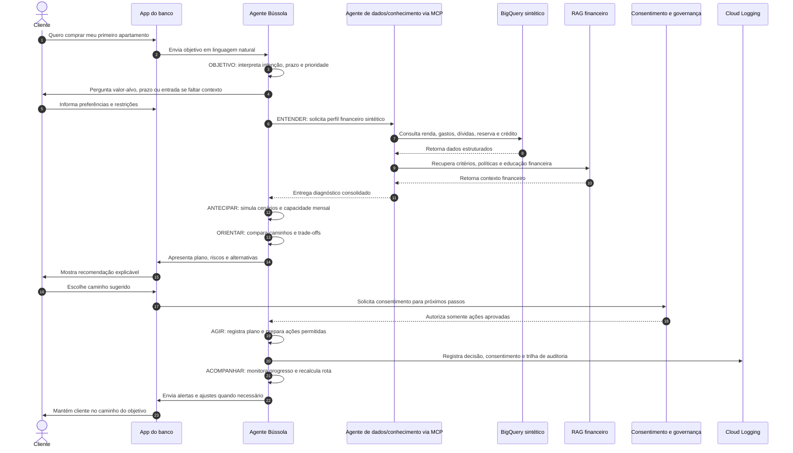

# Jornada Agentic da Bússola

A Bússola organiza a experiência do cliente em uma jornada agentic orientada a objetivos financeiros.

```text
OBJETIVO -> ENTENDER -> ANTECIPAR -> ORIENTAR -> AGIR -> ACOMPANHAR
```

## Diagrama Mermaid — Jornada Agentic



## Estados da jornada

### 1. Objetivo

O cliente declara o que quer realizar. O agente identifica o tipo de objetivo, horizonte de tempo, valor estimado, prioridade e restrições iniciais.

Exemplo:

> "Quero comprar meu primeiro apartamento."

### 2. Entender

A Bússola consulta dados disponíveis, usa dados sintéticos do BigQuery na PoC e pergunta apenas o que não consegue inferir.

Dados considerados:

- renda;
- gastos recorrentes;
- dívidas;
- reserva;
- investimentos;
- capacidade mensal de poupança;
- perfil de crédito;
- prazo desejado;
- recursos já disponíveis.

### 3. Antecipar

O agente simula caminhos possíveis, identifica riscos e estima esforço mensal necessário.

Exemplos de perguntas respondidas:

- O objetivo cabe no prazo desejado?
- Quanto o cliente precisaria guardar por mês?
- O prazo precisa mudar?
- Há dívidas que reduzem a capacidade de realizar o objetivo?
- Existe risco de comprometer a reserva financeira?

### 4. Orientar

A Bússola apresenta cenários comparáveis e recomenda um caminho.

Exemplo:

- **Caminho conservador:** prazo maior, menor esforço mensal e menor risco.
- **Caminho equilibrado:** prazo viável, esforço moderado e ajustes no orçamento.
- **Caminho acelerado:** prazo menor, maior esforço e maior disciplina financeira.

### 5. Agir

O agente propõe próximos passos acionáveis. Ações sensíveis exigem consentimento explícito.

Exemplos:

- criar plano mensal de economia;
- sugerir reorganização de gastos;
- recomendar formação ou reforço de reserva;
- simular financiamento;
- sugerir produto financeiro adequado ao objetivo;
- preparar lembretes e acompanhamento.

### 6. Acompanhar

A Bússola recalcula a rota conforme a vida financeira muda. O agente pode alertar quando o cliente se distancia do plano, quando há oportunidade de acelerar o objetivo ou quando o cenário exige ajuste.

## Autonomia governada

A Bússola pode analisar, simular, recomendar e acompanhar com autonomia. Porém, qualquer ação que envolva contratação, compartilhamento de dados, alteração financeira ou uso de informações externas precisa de consentimento claro.

## Open Finance como evolução

Na PoC, a jornada usa dados sintéticos. Em uma versão futura, a Bússola poderá usar Open Finance para enriquecer a visão financeira do cliente, sempre mediante consentimento.

